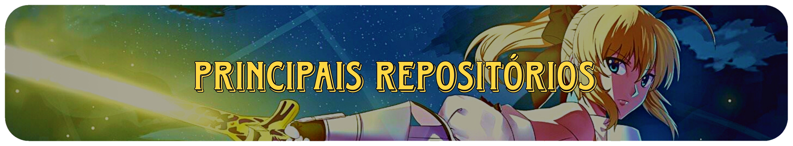

##

 
 

Nome: **Kaiki Kenji**

Cidade: **São Bernardo do Campo (SP)**

Formado: **Desenvolvimento de Software Multiplataforma (FATEC)**

   

    
    
   
   

      
   

     

   * 📗 [***kengiiGMs/SafeAnime***](https://github.com/kengiiGMs/SafeAnime)  
    Site básico utilizando HTML e CSS
   * 📗 [***kengiiGMs/Nori_Nook***](https://github.com/kengiiGMs/Nori_Nook)  
    Sistema de Comandas com React e NodeJS
   * 📗 [***kengiiGMs/FukotoMusic***](https://github.com/kengiiGMs/FukotoMusic)  
    Streaming de Música de Anime
   * 📗 [***kengiiGMs/MangaTo***](https://github.com/kengiiGMs/MangaTo)  
    Biblioteca e Loja de Mangás
   * 📗 [***kengiiGMs/ReactFilmes***](https://github.com/kengiiGMs/ReactFilmes)  
    Consumindo uma API com React
   * 📗 [***kengiiGMs/GeekStore***](https://github.com/kengiiGMs/GeekStore.git)  
    Tela de Inicio (layout), realizado em Flutter

      

    

   
 
      
        
   

   
 
       

   

    
   <i>Somente os guerreiros podem encontrar glória na destruição - <b>Saber</b></i>

##
